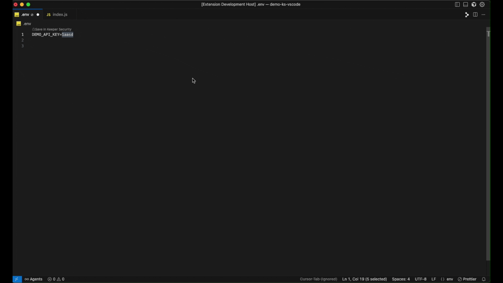
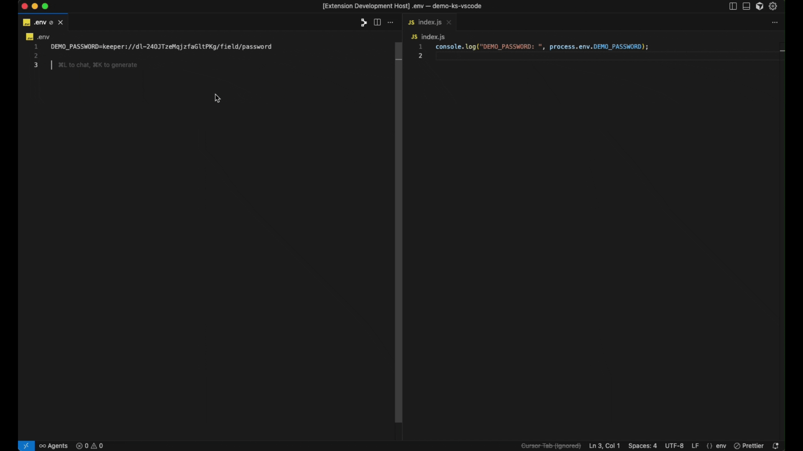
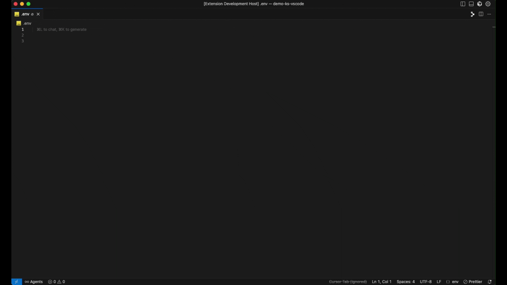
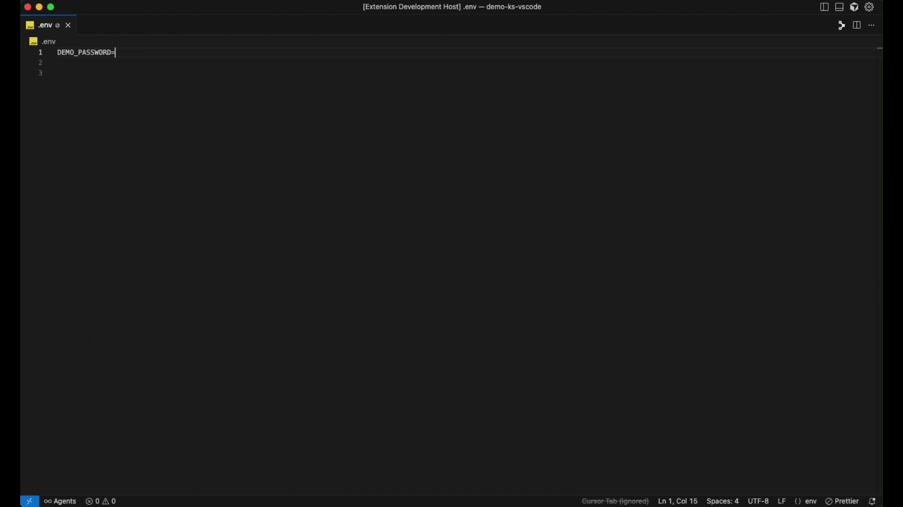

# Keeper Security VS Code Extension

## Table of Contents

- [Overview](#overview)
- [Features](#features)
- [Prerequisites](#prerequisites)
- [Setup](#setup)
- [Usage](#usage)
- [Extension Settings](#extension-settings)
- [Troubleshooting](#troubleshooting)
- [License](#license)

## Overview

A comprehensive VS Code extension that integrates Keeper Security vault functionality directly into the development workflow. The extension provides secure secret management capabilities including saving, retrieving, generating, and running commands with secrets from Keeper Security vault.

This enable developers to manage secrets securely without leaving their development environment, while maintaining the highest security standards and providing seamless integration with existing Keeper Security infrastructure.

## Features

- **Secret Management**: Save, retrieve, and generate secrets directly from VS Code using Keeper Security vault
- **Secret Detection**: Automatically detect potential secrets from configuration files using pattern recognition (API keys, passwords, tokens, JWT, AWS keys, Stripe keys, and more)
- **Secure Execution**: Run commands with secrets injected from Keeper vault
- **Comprehensive Logging**: Built-in logging system with debug mode support

## Prerequisites

- **Keeper Commander CLI**:
  - The **Keeper Commander CLI** must be installed globally on your system using the official binary.
  - Authenticated using [Persistent login](https://docs.keeper.io/en/keeperpam/commander-cli/commander-installation-setup/logging-in#persistent-login-sessions-stay-logged-in) or [Biometric login](https://docs.keeper.io/en/keeperpam/commander-cli/commander-installation-setup/logging-in#logging-in-with-biometric-authentication)
- **Keeper Security Account**: Active subscription with vault access
- **System Requirements**:
  - **VS Code**: 1.99.0 or later

## Setup

### Install Keeper Commander CLI Binary

1. Follow the [Keeper Commander Installation Guide](https://docs.keeper.io/en/keeperpam/commander-cli/commander-installation-setup) to download and install the binary for your operating system.
    - [Windows Installation](https://docs.keeper.io/en/keeperpam/commander-cli/commander-installation-setup/installation-on-windows#typical-binary-installation-recommended)
    - [MacOS Installation](https://docs.keeper.io/en/keeperpam/commander-cli/commander-installation-setup/installation-on-mac#binary-installation)
    - [Linux Installation](https://docs.keeper.io/en/keeperpam/commander-cli/commander-installation-setup/installation-on-linux)
2. Ensure the CLI is accessible from your system shell PATH
3. Open your terminal and run the following command to verify the installation:
    - `keeper --version`
    - You should see output similar to: `Keeper Commander, version 17.1.8`
    - This confirms that the Commander CLI is installed and accessible globally.

    > After successfully installing the Keeper Commander CLI, please **reopen VS Code** if it was open during the installation.

### Authenticate with Keeper Commander CLI

1. Open your terminal or command prompt.
2. Run the following command: `keeper shell`
3. If you're not already logged in, you'll be prompted to enter your Keeper credentials. Follow the prompts to complete the login process.
4. Upon successful login, you'll see the command prompt change to: `My Vault>`
5. While still inside the `My Vault>` prompt, you must complete one of the following steps to complete setup: 
    - [Persistent login](https://docs.keeper.io/en/keeperpam/commander-cli/commander-installation-setup/logging-in#persistent-login-sessions-stay-logged-in):
        1. Run: `this-device persistent-login on`
        2. Then run: `this-device register`
        > **Note:** To set the inactivity logout timer to a certain number of minutes: Run `this-device timeout 600`. This successfully set "logout_timer" to 10 hours.

    - [Biometric login](https://docs.keeper.io/en/keeperpam/commander-cli/commander-installation-setup/logging-in#logging-in-with-biometric-authentication):
        - Run: `biometric register`
        - A biometric authentication prompt (fingerprint or Face ID) will be displayed. With successful fingerprint or faceID authentication the registration will be completed.

Refer to the [Logging in](https://newdocs.keeper.io/keeperpam-and-secrets-manager/~/changes/1754/commander-cli/commander-installation-setup/logging-in) guide for full details.

### Install the extension

From the Extensions Marketplace: Search `Keeper Security` and install the extension.

### Verify Extension Access

1. Open VS Code Command Palette (`Ctrl+Shift+P` / `Cmd+Shift+P`)
2. Type `Keeper Security` to see all available commands

 

> **Note**: If you've made configuration changes to the Commander CLI manually, please reload your editor window by pressing **Ctrl+Shift+P** (or **Cmd+Shift+P** on Mac), then select `Developer: Reload Window`.

## Usage

### Available Commands

Once authenticated, you can access the following commands through the Command Palette (`Ctrl+Shift+P` / `Cmd+Shift+P`):

| Command | Description | Use Case |
|---------|-------------|----------|
| **Save in Keeper Security** | Save selected text as secret in vault | Save and Replace hardcoded secrets with keeper references |
| **Get from Keeper Security** | Insert existing secrets from vault as keeper references | Retrieve stored secrets without exposing values |
| **Run Securely** | Execute commands with injected keeper secrets | Run applications with vault credentials |
| **Choose Folder** | Select vault folder for storing secrets in there | To store secret in specific folder |
| **Generate Password** | Generate and store secure passwords in vault | Create new secure credentials |
| **Open Logs** | View extension activity logs | Debug and monitor extension operations |

### Commands Details:

### Save in Keeper Vault

1. **Using Command Palette**

    **Purpose**: Save selected text as a secret in Keeper Security vault and replace it with a keeper reference.

    **Steps**:
    1. Select text containing a secret (password, token, API key, ...etc)
    2. Open Command Palette (`Ctrl+Shift+P` / `Cmd+Shift+P`)
    3. Type `Keeper Security: Save in Keeper Vault` and select it
    4. Extension will authenticate with Keeper Security (if needed)
    5. Enter record / field name 
    6. Extension creates new item in Keeper vault
    7. Selected text is replaced with keeper reference (`keeper://...`) at users last cursor position

2. **Automatic Secret Detection**

    **Purpose**: Automatically detect potential secrets in your code for easy identification and securing.

    **Features**:
    - Extension scans files for known secret patterns
    - Provides CodeLens for detected secrets
    - CodeLens shows `Save in Keeper Security` option over the secret
    - Click CodeLens and follow prompts to save detected secret
    - The keeper reference will be automatically replaced with detected secret at users last cursor position

    **Supported File Types**:
    - **Environment Files**: eg. `.env`, `.env.*`
    - **Configuration Files**: eg. `config.json`, `docker-compose.yml`

**Example**:

### Get from Keeper Vault

**Purpose**: Insert existing Keeper Security secrets into your code as keeper reference without exposing actual values.

**Steps**:

1. Open Command Palette
2. Type `Keeper Security: Get from Keeper Vault` and select it
3. Extension shows list of available records
4. Select specific `record` and then `field` that you want to use
5. Extension inserts secret reference at users last cursor position

**Reference Format**: `keeper://record-uid/field/item`

**Example**:

### Run Securely

**Purpose**: Execute a command by injecting secret values fetched from Keeper Vault, based on Keeper references defined in a selected `.env` file.

**Steps**:

1. Open Command Palette 
Press `Ctrl+Shift+P` (Windows/Linux) or `Cmd+Shift+P` (macOS)
2. Search and select `Keeper Security: Run Securely`.
3. Choose a `.env` file:
    - A dropdown will display available `.env` files from your current workspace.
    - Alternatively, select **"Browse Environment File"** to choose a `.env` file from another location.
    - If hidden files (like `.env`) are not visible in the file dialog:
        - On macOS, press `Cmd + Shift + .`
        - On Windows, press `Ctrl + H` (in some file dialogs)
        - On Linux, press `Ctrl + H`
4. Enter the command you want to run.
5. Extension creates terminal with injected secrets from selected `.env` and executes command

> **Note:** To make use of the injected secret values in your application, your code must reference the corresponding environment variables (e.g., `process.env.DB_PASSWORD`, `os.environ.get("API_KEY")`, etc.). 
The `.env` file should contain Keeper references (e.g., DB_PASSWORD=keeper://...) which are resolved at runtime when you use Run Securely.

**Example**:

### Choose Folder

**Purpose**: Specify the vault folder where secrets for this workspace will be stored.

**Steps**:

1. Open Command Palette
2. Type `Keeper Security: Choose Folder` and select it
3. Extension displays available vault folders
4. Select desired folder for this workspace
5. Future `Save in Keeper Security` and `Generate Password` operations will use the selected folder to store secret in your Keeper Vault.

### Generate Password

**Purpose**: Generate secure passwords and store them in Keeper Security vault.

**Steps**:

1. Open Command Palette
2. Type `Keeper Security: Generate Password` and select it
3. Enter `record` name
4. Password reference will inserted at users last cursor position

**Example**:

### Open Logs

**Purpose**: View extension activity logs for debugging and monitoring.

**Steps**:

1. Open Command Palette
2. Type `Keeper Security: Open Logs` and select it
3. Extension opens output panel with detailed logs

**Example**:

## Extension Settings 

The extension provides configuration options:

1. Open Editor Settings (`Ctrl+,` / `Cmd+,`)
2. Search for `Keeper Security`
3. Configure the following options:

| Setting | Description | Default |
|---------|-------------|---------|
| **Debug Enabled** | Enable detailed logging for debugging | `false` |
| **Secret Detection** | Enable automatic secret detection | `true` |

> **Note:** Debug mode requires reloading the extension to take effect. 
Press **Ctrl+Shift+P** (or **Cmd+Shift+P** on Mac), then select `Developer: Reload Window`

## Troubleshooting

### Debug Mode

Enable debug logging to see detailed information about extension operations:

1. Open VS Code Settings (`Ctrl+,` / `Cmd+,`)
2. Search for "Keeper Security"
3. Enable "Debug" option
4. Reload the window (`Ctrl+Shift+P` (or `Cmd+Shift+P` on Mac) → **"Developer: Reload Window"**)

### Common Issues

#### 1. Extension General Issues

**Problem**: Extension takes time to fetch secrets, shows loading continuously, fails to resolve keeper references, latest records not displaying from keeper vault, manual keeper commander CLI authentication changes, or other unexpected issue.

**Solutions**:

- **Reload Editor Window** (`Ctrl+Shift+P` (or `Cmd+Shift+P` on Mac) → **"Developer: Reload Window"**)
- Ensure Keeper Commander CLI is authenticated with **Persistent login** or **Biometric login**
- Check internet connection and firewall settings
- Verify Keeper vault accessibility
- Clear extension cache if issues persist

#### 2. Keeper Commander CLI Not Found

**Problem**: "Keeper Commander CLI is not installed" error

**Solutions**:

- Install Keeper Commander CLI Binary for your OS by following the [installation guide](https://docs.keeper.io/en/keeperpam/commander-cli/commander-installation-setup)
- Ensure CLI is accessible from your system PATH
- Verify installation with `keeper --version` in terminal

#### 3. Authentication Failures

**Problem**: "Keeper Commander CLI is not authenticated" errors

**Solutions**:

- Open your terminal or command prompt.
- Run the following command: `keeper shell`
- If you're not already logged in, you'll be prompted to enter your Keeper credentials. Follow the prompts to complete the login process.
- Upon successful login, you'll see the command prompt change to: `My Vault>`
- Then follow these steps to enable [Persistent login](https://docs.keeper.io/en/keeperpam/commander-cli/commander-installation-setup/logging-in#persistent-login-sessions-stay-logged-in) or [Biometric login](https://docs.keeper.io/en/keeperpam/commander-cli/commander-installation-setup/logging-in#logging-in-with-biometric-authentication)

Refer to the [Logging in guide](https://newdocs.keeper.io/keeperpam-and-secrets-manager/~/changes/1754/commander-cli/commander-installation-setup/logging-in) for full details.

> **Note**: If you've made configuration changes to the Commander CLI manually, please reload your editor window by pressing **Ctrl+Shift+P** (or **Cmd+Shift+P** on Mac), then select `Developer: Reload Window`.

#### 4. Commands Not Available

**Problem**: Keeper Security extension commands don't appear in Command Palette

**Solution**:

- Ensure you have installed correct `Keeper Security` extension.
- Reload VS Code window if commands still don't appear
- Check the extension is properly enabled/activated

#### 5. Extension Not Loading

**Problem**: Extension fails to activate or shows errors

**Solutions**:

- Check VS Code version compatibility (requires `1.99.0` or later)
- Verify Node.js version (requires 18.0.0 or later)
- Try reinstalling the extension

#### 7. Run Securely Command Issues

**Problem**: Commands don't have access to injected secrets

**Solutions**:

- To run commands with secrets injected, use the `Keeper Security: Run Securely` command from the Command Palette.
- Verify your `.env` file contains valid `keeper://` references
- Ensure all referenced secrets exist in your vault
- Ensure other unnecessary terminals are deleted and Check that the latest terminal is created by the extension

#### 8. Folder Selection Issues

**Problem**: Cannot select or change vault folders

**Solutions**:

- Ensure you have proper permissions to folders in your vault
- Check that Keeper Commander CLI has proper permissions
- Verify folder structure in your vault
- Try reloading the window.

## License

This extension is licensed under the MIT License.
